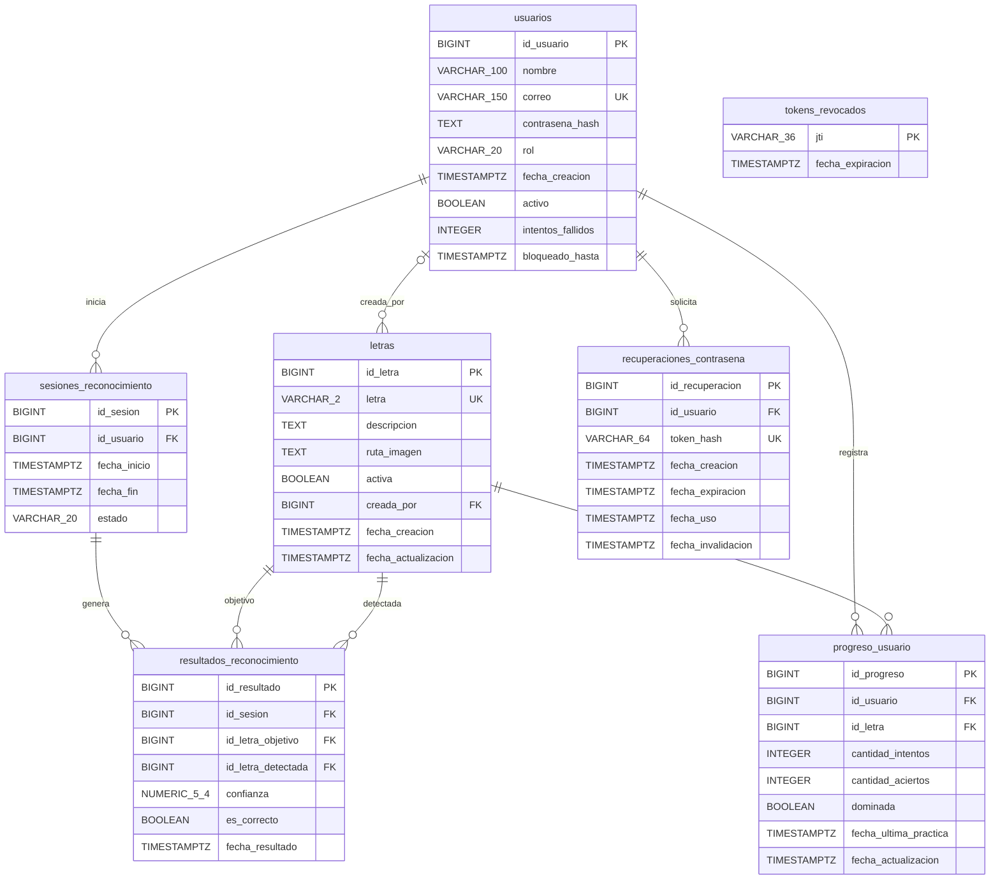

```mermaid
erDiagram
    usuarios {
        BIGINT id_usuario PK
        VARCHAR_100 nombre
        VARCHAR_150 correo UK
        TEXT contrasena_hash
        VARCHAR_20 rol
        TIMESTAMPTZ fecha_creacion
        BOOLEAN activo
        INTEGER intentos_fallidos
        TIMESTAMPTZ bloqueado_hasta
    }

    letras {
        BIGINT id_letra PK
        VARCHAR_2 letra UK
        TEXT descripcion
        TEXT ruta_imagen
        BOOLEAN activa
        BIGINT creada_por FK
        TIMESTAMPTZ fecha_creacion
        TIMESTAMPTZ fecha_actualizacion
    }

    sesiones_reconocimiento {
        BIGINT id_sesion PK
        BIGINT id_usuario FK
        TIMESTAMPTZ fecha_inicio
        TIMESTAMPTZ fecha_fin
        VARCHAR_20 estado
    }

    resultados_reconocimiento {
        BIGINT id_resultado PK
        BIGINT id_sesion FK
        BIGINT id_letra_objetivo FK
        BIGINT id_letra_detectada FK
        NUMERIC_5_4 confianza
        BOOLEAN es_correcto
        TIMESTAMPTZ fecha_resultado
    }

    progreso_usuario {
        BIGINT id_progreso PK
        BIGINT id_usuario FK
        BIGINT id_letra FK
        INTEGER cantidad_intentos
        INTEGER cantidad_aciertos
        BOOLEAN dominada
        TIMESTAMPTZ fecha_ultima_practica
        TIMESTAMPTZ fecha_actualizacion
    }

    recuperaciones_contrasena {
        BIGINT id_recuperacion PK
        BIGINT id_usuario FK
        VARCHAR_64 token_hash UK
        TIMESTAMPTZ fecha_creacion
        TIMESTAMPTZ fecha_expiracion
        TIMESTAMPTZ fecha_uso
        TIMESTAMPTZ fecha_invalidacion
    }

    tokens_revocados {
        VARCHAR_36 jti PK
        TIMESTAMPTZ fecha_expiracion
    }

    usuarios |o--o{ letras : creada_por
    usuarios ||--o{ sesiones_reconocimiento : inicia
    sesiones_reconocimiento ||--o{ resultados_reconocimiento : genera
    letras ||--o{ resultados_reconocimiento : objetivo
    letras ||--o{ resultados_reconocimiento : detectada
    usuarios ||--o{ progreso_usuario : registra
    letras ||--o{ progreso_usuario : corresponde
    usuarios ||--o{ recuperaciones_contrasena : solicita
```
