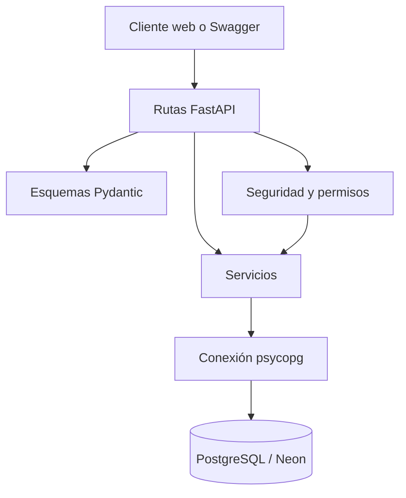

# Backend de SignIA

Esta guía describe la implementación actual del backend de SignIA. Su propósito es permitir que un integrante comprenda cómo está organizado el código, cómo se ejecuta localmente, cómo funciona la API y qué archivos debe modificar al agregar una nueva funcionalidad.

La documentación se considera viva: debe actualizarse cada vez que cambien las rutas, los servicios, los esquemas, las variables de entorno, las dependencias o el procedimiento de ejecución.

## 1. Alcance actual

El backend está construido con FastAPI y PostgreSQL. Actualmente permite:

- Comprobar el estado de la API.
- Autenticar usuarios registrados mediante correo y contraseña.
- Generar tokens JWT para las sesiones autenticadas.
- Consultar la información del usuario asociado a un token.
- Consultar las letras activas del alfabeto LSC.
- Consultar el detalle de una letra mediante su identificador.
- Actualizar parcialmente la descripción o la ruta de imagen de una letra.
- Restringir la actualización de letras a usuarios con rol `administrador`.
- Validar los datos enviados antes de ejecutar una actualización.

Las tablas de sesiones de reconocimiento, resultados y progreso ya existen en la base de datos, pero todavía no cuentan con rutas ni servicios en la API.

## 2. Arquitectura general

El backend usa una separación sencilla por responsabilidades:



El recorrido habitual de una solicitud es el siguiente:

1. El cliente envía una solicitud HTTP.
2. FastAPI la dirige al módulo correspondiente de `app/routes`.
3. Pydantic valida los datos de entrada y define el formato de salida.
4. Las dependencias de seguridad validan el token y, cuando aplica, el rol.
5. La ruta llama una función de `app/services`.
6. El servicio ejecuta una consulta parametrizada en PostgreSQL.
7. La ruta devuelve una respuesta controlada al cliente.

No se utiliza un ORM. Los servicios trabajan con SQL y cursores de `psycopg`, configurados con `dict_row` para devolver registros similares a diccionarios.

## 3. Estructura del backend

```text
FIS_2630_1204_G4/
├── app/
│   ├── main.py
│   ├── security.py
│   ├── controllers/                 # Reservado; aún sin implementación
│   ├── routes/
│   │   ├── autenticacion.py
│   │   └── letras.py
│   ├── services/
│   │   ├── autenticacion_service.py
│   │   └── letras_service.py
│   └── vision/                      # Implementado
├── conf/
│   ├── config.py                    # Reservado; actualmente vacío
│   ├── database.py
│   └── environment.example          # Reservado; actualmente vacío
├── database/
│   ├── README.md
│   ├── diagrama-er.md
│   ├── schema.sql
│   └── seed.sql
├── scripts/
│   ├── deploy.sh                    # Marcador vacío
│   ├── setup.sh                     # Marcador vacío
│   ├── start.sh                     # Marcador vacío
│   ├── test.sh                      # Marcador vacío
│   └── test_db_connection.py
├── src/
│   ├── middleware/                  # Reservado; aún sin implementación
│   ├── models/                      # Reservado; no se usa ORM actualmente
│   ├── schemas/
│   │   ├── autenticacion.py
│   │   └── letra.py
│   ├── tests/
│   │   ├── test_autenticacion.py
│   │   └── test_letras.py
│   └── utils/                       # Reservado; aún sin implementación
├── .env.example
└── requirements.txt
```

Las carpetas que contienen únicamente `.gitkeep` se conservan como parte de la estructura planeada, pero no deben documentarse como componentes funcionales hasta que contengan código.

## 4. Componentes principales

### `app/main.py`

Es el punto de entrada de FastAPI. Este archivo:

- Crea la aplicación `SignIA API` con versión `1.0.0`.
- registra los routers de autenticación y letras;
- configura CORS para los puertos locales `3000` y `5173`;
- expone `GET /health` para comprobar el estado del backend.

Los orígenes permitidos actualmente son:

```text
http://localhost:3000
http://127.0.0.1:3000
http://localhost:5173
http://127.0.0.1:5173
```

### `app/routes`

Contiene las operaciones HTTP. Las rutas reciben y validan solicitudes, llaman los servicios y convierten los resultados en respuestas controladas.

- `autenticacion.py`: implementa el inicio de sesión y la consulta del usuario actual.
- `letras.py`: implementa el listado, el detalle y la actualización de letras.

La carpeta `app/controllers` todavía no se utiliza. En la implementación actual, la coordinación equivalente a un controlador se realiza directamente en los módulos de rutas.

### `app/services`

Contiene la lógica que consulta PostgreSQL.

`autenticacion_service.py` incluye:

- `obtener_usuario_por_correo`: busca un usuario sin distinguir mayúsculas y minúsculas en el correo.
- `obtener_usuario_por_id`: recupera los datos públicos de un usuario.
- `autenticar_usuario`: verifica la contraseña almacenada y elimina el hash de la respuesta.
- `generar_hash_contrasena`: genera hashes seguros para contraseñas.

`letras_service.py` incluye:

- `obtener_letras_registradas`: devuelve únicamente letras activas y las ordena alfabéticamente.
- `obtener_letra_por_id`: consulta una letra por su identificador. Esta operación no filtra por el campo `activa`.
- `actualizar_informacion_letra`: actualiza solamente los campos enviados y devuelve el registro resultante.

La actualización usa `WHERE id_letra = %s`, por lo que solo afecta la letra seleccionada. Los parámetros se envían por separado y no se concatenan dentro del SQL.

### `app/security.py`

Centraliza la autenticación y la autorización:

- genera JWT con el algoritmo `HS256`;
- almacena el identificador del usuario en la declaración `sub`;
- agrega las fechas `iat` y `exp`;
- extrae el token del encabezado `Authorization: Bearer`;
- vuelve a consultar al usuario en PostgreSQL;
- devuelve `401` cuando el token falta, es inválido o pertenece a un usuario inexistente;
- devuelve `403` cuando un usuario autenticado no tiene rol de administrador.

El rol no se toma de un valor enviado por el frontend. El token contiene el identificador y el backend consulta el rol actual en la base de datos antes de autorizar la operación.

### `src/schemas`

Los esquemas Pydantic definen los datos aceptados y el formato de las respuestas.

`autenticacion.py` contiene:

- `CredencialesLogin`;
- `UsuarioAutenticadoRespuesta`;
- `TokenRespuesta`.

`letra.py` contiene:

- `LetraRespuesta`;
- `LetraActualizacion`;
- `LetraActualizacionRespuesta`.

En una actualización, `descripcion` y `ruta_imagen` son opcionales individualmente. Si uno de ellos se envía, no puede ser `null`, estar vacío ni contener únicamente espacios. Los espacios sobrantes al inicio y al final se eliminan antes de llamar al servicio.

### `conf/database.py`

Carga las variables del archivo `.env` y crea conexiones mediante `psycopg`. Si `DATABASE_URL` no existe, genera un error explícito. Las rutas no abren conexiones directamente; esta responsabilidad se concentra en los servicios.

### `database`

Contiene la definición de cinco tablas:

- `usuarios`;
- `letras`;
- `sesiones_reconocimiento`;
- `resultados_reconocimiento`;
- `progreso_usuario`.

La explicación de las tablas, restricciones, datos de prueba e inicialización se encuentra en [database/README.md](../database/README.md). El modelo visual está disponible en [database/diagrama-er.md](../database/diagrama-er.md).

El archivo `seed.sql` contiene hashes de contraseña deliberadamente no utilizables. Los usuarios insertados por ese archivo no pueden iniciar sesión hasta que sus hashes sean reemplazados por valores Argon2 válidos.

## 5. API disponible

| Método | Ruta | Acceso | Descripción | Respuestas principales |
|---|---|---|---|---|
| `GET` | `/health` | Público | Comprueba que la aplicación responde. | `200` |
| `POST` | `/auth/login` | Público | Valida correo y contraseña y genera un JWT. | `200`, `401`, `422`, `500` |
| `GET` | `/auth/me` | Usuario autenticado | Devuelve el usuario asociado al token. | `200`, `401` |
| `GET` | `/letras` | Público | Lista las letras activas en orden alfabético. | `200`, `500` |
| `GET` | `/letras/{id_letra}` | Público | Consulta una letra mediante su identificador. | `200`, `404`, `500` |
| `PATCH` | `/letras/{id_letra}` | Administrador | Actualiza parcialmente descripción o imagen. | `200`, `400`, `401`, `403`, `404`, `422`, `500` |

### Inicio de sesión

Solicitud:

```json
{
  "correo": "admin.prueba@signia.local",
  "contrasena": "<contraseña registrada>"
}
```

Respuesta exitosa:

```json
{
  "access_token": "<token JWT>",
  "token_type": "bearer",
  "usuario": {
    "id_usuario": 2,
    "nombre": "Administrador de prueba",
    "correo": "admin.prueba@signia.local",
    "rol": "administrador"
  }
}
```

Las credenciales incorrectas producen `401`. Los errores inesperados al consultar la base de datos o generar el token producen `500` sin exponer detalles internos.

### Uso del token

Las rutas protegidas esperan este encabezado:

```http
Authorization: Bearer <token JWT>
```

En Swagger UI se debe pulsar **Authorize** y pegar únicamente el token.

### Consulta de letras

`GET /letras` devuelve una lista con esta forma:

```json
[
  {
    "id_letra": 1,
    "letra": "A",
    "descripcion": "Representación de la letra A",
    "ruta_imagen": "assets/alfabeto/a.png"
  }
]
```

Si no existen letras activas, la respuesta es `[]`.

### Actualización de una letra

El cuerpo puede incluir uno o los dos campos editables:

```json
{
  "descripcion": "Descripción actualizada",
  "ruta_imagen": "assets/alfabeto/a.png"
}
```

También es válida una actualización parcial:

```json
{
  "descripcion": "Descripción actualizada"
}
```

El campo omitido conserva su valor anterior. Una solicitud vacía produce `400`; un campo nulo, vacío o compuesto únicamente por espacios produce `422`.

Respuesta exitosa:

```json
{
  "mensaje": "La letra fue actualizada correctamente",
  "letra": {
    "id_letra": 1,
    "letra": "A",
    "descripcion": "Descripción actualizada",
    "ruta_imagen": "assets/alfabeto/a.png"
  }
}
```

Sin token la operación produce `401`; con un usuario que no sea administrador produce `403`.

## 6. Tecnologías y dependencias

El proyecto usa Python 3.12 durante el desarrollo y las siguientes dependencias fijadas en `requirements.txt`:

| Dependencia | Versión | Uso |
|---|---:|---|
| FastAPI | `0.141.1` | API HTTP, validación e inyección de dependencias. |
| Uvicorn | `0.52.4` | Servidor ASGI para ejecutar FastAPI. |
| psycopg | `3.3.4` | Conexión y consultas a PostgreSQL. |
| python-dotenv | `1.2.3` | Carga de variables desde `.env`. |
| pwdlib con Argon2 | `0.3.1` | Generación y verificación de hashes de contraseña. |
| PyJWT | `2.13.0` | Creación y validación de tokens JWT. |
| httpx | `0.28.1` | Cliente utilizado por `TestClient` en las pruebas HTTP. |

## 7. Variables de entorno

El archivo `.env.example` contiene las variables requeridas:

```env
DATABASE_URL=
JWT_SECRET=
JWT_EXPIRE_MINUTES=60
```

| Variable | Obligatoria | Descripción |
|---|---|---|
| `DATABASE_URL` | Sí | Cadena de conexión de PostgreSQL o Neon. |
| `JWT_SECRET` | Sí | Clave privada usada para firmar los tokens. |
| `JWT_EXPIRE_MINUTES` | No | Duración del token en minutos; usa `60` por defecto. |

Para generar una clave JWT aleatoria se puede ejecutar:

```bash
python -c "import secrets; print(secrets.token_urlsafe(32))"
```

Se recomienda utilizar una clave de al menos 32 bytes. El archivo `.env` contiene información privada, está excluido de Git y nunca debe incluirse en commits, capturas o documentación.

## 8. Instalación local

### Requisitos

- Git.
- Python 3.12.
- Acceso a una base PostgreSQL o Neon.
- Cliente `psql` solamente si se crearán tablas desde la terminal.

Actualmente no existe una configuración funcional de Docker en el repositorio. Los archivos `.sh` de `scripts` también permanecen vacíos, por lo que la instalación y ejecución se realizan con los comandos descritos en esta guía.

### Clonar el repositorio

```bash
git clone https://github.com/puj-course/FIS_2630_1204_G4.git
cd FIS_2630_1204_G4
```

### Crear el entorno virtual

Linux:

```bash
python3.12 -m venv .venv
source .venv/bin/activate
```

Alternativamente, con `uv`:

```bash
uv venv --python 3.12 .venv
source .venv/bin/activate
```

Windows PowerShell:

```powershell
py -3.12 -m venv .venv
.venv\Scripts\Activate.ps1
```

### Instalar dependencias

```bash
python -m pip install -r requirements.txt
```

Si se utiliza `uv`:

```bash
uv pip install -r requirements.txt
```

### Crear el archivo `.env`

Linux:

```bash
cp .env.example .env
```

Windows PowerShell:

```powershell
Copy-Item .env.example .env
```

Después se deben completar `DATABASE_URL` y `JWT_SECRET`. `JWT_EXPIRE_MINUTES` puede conservar el valor `60`.

### Preparar y comprobar PostgreSQL

Las instrucciones completas para crear las tablas y cargar datos de prueba están en [database/README.md](../database/README.md).

Para comprobar la conexión configurada:

```bash
python scripts/test_db_connection.py
```

El resultado esperado incluye `Conexión exitosa con Neon` y la lista de tablas disponibles.

### Iniciar FastAPI

Desde la raíz del repositorio:

```bash
uvicorn app.main:app --reload
```

Direcciones locales:

- API: `http://127.0.0.1:8000`
- Estado: `http://127.0.0.1:8000/health`
- Swagger UI: `http://127.0.0.1:8000/docs`
- ReDoc: `http://127.0.0.1:8000/redoc`
- Esquema OpenAPI: `http://127.0.0.1:8000/openapi.json`

El servidor se detiene con `Ctrl + C`.

## 9. Pruebas

La suite usa `unittest`, `unittest.mock` y `fastapi.testclient.TestClient`.

Para ejecutar todas las pruebas:

```bash
python -m unittest discover -s src/tests -v
```

Estado actual:

- 10 pruebas de autenticación.
- 15 pruebas de letras y permisos.
- 25 pruebas en total.

Las pruebas cubren credenciales correctas e incorrectas, errores de base de datos, generación y validación de tokens, consultas de letras, listado vacío, actualización parcial, validación de datos y autorización administrativa.

Durante las pruebas de errores aparecen trazas generadas por `logger.exception`. Son esperadas porque esas pruebas provocan excepciones simuladas. El resultado válido debe finalizar con:

```text
Ran 25 tests
OK
```

Actualmente puede aparecer una advertencia de compatibilidad de `TestClient` relacionada con `httpx`. La advertencia no hace fallar la suite, pero deberá revisarse cuando se actualicen FastAPI y sus dependencias.

## 10. Manejo de errores

Las rutas capturan errores inesperados, registran la excepción internamente y devuelven mensajes generales. No se envían cadenas de conexión, hashes, trazas ni detalles internos al cliente.

Los códigos usados actualmente son:

| Código | Significado en la API |
|---:|---|
| `200` | Operación completada. |
| `400` | Solicitud de actualización sin campos. |
| `401` | Credenciales incorrectas o token ausente/inválido. |
| `403` | Usuario autenticado sin rol de administrador. |
| `404` | Letra inexistente. |
| `422` | Datos que no cumplen el esquema. |
| `500` | Error interno o fallo de acceso a PostgreSQL. |

## 11. Cómo agregar una funcionalidad

Para mantener la separación actual, una nueva operación normalmente requiere:

1. Crear o actualizar el esquema en `src/schemas`.
2. Implementar la consulta o lógica de datos en `app/services`.
3. Crear la operación HTTP en `app/routes`.
4. Agregar una dependencia de autenticación o permisos cuando corresponda.
5. Registrar el router en `app/main.py` si pertenece a un módulo nuevo.
6. Agregar pruebas de éxito, datos vacíos, registros inexistentes, permisos y errores.
7. Actualizar este archivo, la tabla de endpoints y las variables de entorno.

Las consultas deben continuar usando parámetros de `psycopg`. No deben construirse concatenando datos recibidos del usuario.

## 12. Funcionalidades implementadas por subissue

| Funcionalidad | Implementación actual |
|---|---|
| Consultar letras registradas | `GET /letras` y `obtener_letras_registradas`. |
| Consultar el detalle de una letra | `GET /letras/{id_letra}` y `obtener_letra_por_id`. |
| Autenticar usuarios | `POST /auth/login`, Argon2 y JWT. |
| Consultar el usuario autenticado | `GET /auth/me`. |
| Actualizar una letra | `PATCH /letras/{id_letra}` y SQL `UPDATE ... RETURNING`. |
| Restringir la edición | Dependencia `requerir_administrador`. |
| Validar datos editables | `field_validator` en `LetraActualizacion`. |

## 13. Componentes pendientes o reservados

La estructura contiene espacios para funcionalidades futuras. A la fecha de esta guía todavía no están implementados:

- Registro de usuarios mediante un endpoint.
- Renovación, revocación o cierre de sesión de tokens.
- Carga física de imágenes; actualmente solo se actualiza `ruta_imagen`.
- Rutas para sesiones de reconocimiento, resultados y progreso.
- Integración del módulo de visión por computador dentro de `app/vision`.
- Controladores independientes en `app/controllers`.
- Middleware propio en `src/middleware`.
- Scripts automáticos de instalación, pruebas, inicio y despliegue.
- Configuración de Docker o Docker Compose.

Esta sección debe reducirse o actualizarse cuando esos componentes sean implementados.

## 14. Lista de mantenimiento

En cada PR que modifique el backend se debe comprobar si también cambió alguno de estos elementos:

- [ ] Estructura de carpetas.
- [ ] Endpoints y códigos de respuesta.
- [ ] Esquemas de entrada o salida.
- [ ] Servicios o consultas SQL.
- [ ] Reglas de autenticación y permisos.
- [ ] Variables de entorno.
- [ ] Dependencias y versiones.
- [ ] Instrucciones de instalación o ejecución.
- [ ] Cantidad y alcance de las pruebas.
- [ ] Funcionalidades pendientes.

La subissue general de documentación puede permanecer abierta durante el desarrollo. Cada cambio del backend debe incluir la actualización correspondiente de esta guía.