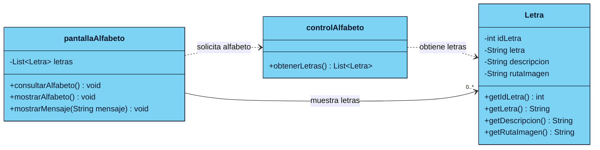

```mermaid
classDiagram
    direction LR

    class pantallaAlfabeto {
        -List~Letra~ letras
        +consultarAlfabeto() void
        +mostrarAlfabeto() void
        +mostrarMensaje(String mensaje) void
    }

    class controlAlfabeto {
        +obtenerLetras() List~Letra~
    }

    class Letra {
        -int idLetra
        -String letra
        -String descripcion
        -String rutaImagen
        +getIdLetra() int
        +getLetra() String
        +getDescripcion() String
        +getRutaImagen() String
    }

    pantallaAlfabeto ..> controlAlfabeto : solicita alfabeto
    controlAlfabeto ..> Letra : obtiene letras
    pantallaAlfabeto --> "0..*" Letra : muestra letras

    style pantallaAlfabeto fill:#7DD3F4,stroke:#0F172A,color:#0F172A
    style controlAlfabeto fill:#7DD3F4,stroke:#0F172A,color:#0F172A
    style Letra fill:#7DD3F4,stroke:#0F172A,color:#0F172A
```
