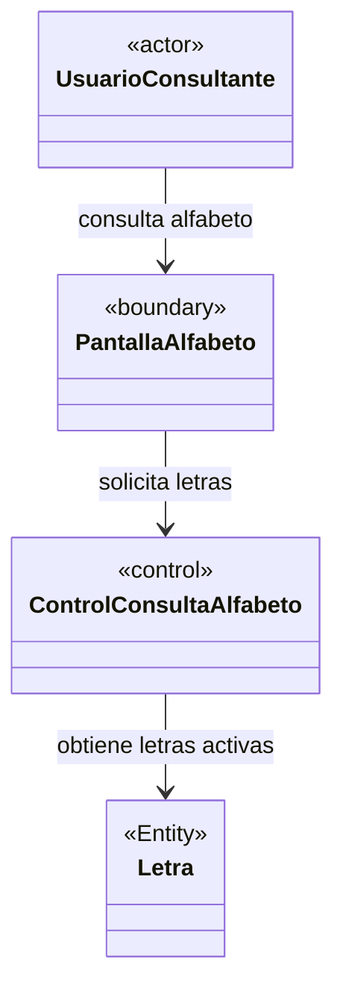

# Diagrama EBC — Consulta del alfabeto

```mermaid
classDiagram
    direction TB

    class UsuarioConsultante {
        <<actor>>
    }

    class PantallaAlfabeto {
        <<boundary>>
    }

    class ControlConsultaAlfabeto {
        <<control>>
    }

    class Letra {
        <<Entity>>
    }

    UsuarioConsultante --> PantallaAlfabeto : consulta alfabeto
    PantallaAlfabeto --> ControlConsultaAlfabeto : solicita letras
    ControlConsultaAlfabeto --> Letra : obtiene letras activas
```
