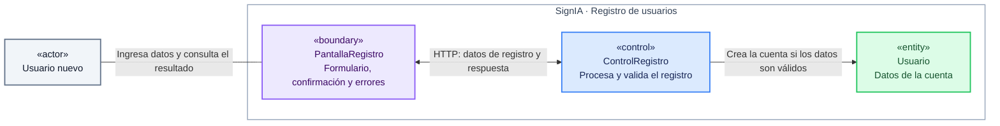

```mermaid
flowchart LR
    ACTOR["«actor»
    Usuario nuevo"]

    subgraph SIGNIA["SignIA · Registro de usuarios"]
        direction LR
        PANTALLA["«boundary»
        PantallaRegistro
        Formulario, confirmación y errores"]
        CONTROL["«control»
        ControlRegistro
        Procesa y valida el registro"]
        USUARIO["«entity»
        Usuario
        Datos de la cuenta"]

        PANTALLA <-->|"HTTP: datos de registro y respuesta"| CONTROL
        CONTROL -->|"Crea la cuenta si los datos son válidos"| USUARIO
    end

    ACTOR ---|"Ingresa datos y consulta el resultado"| PANTALLA

    classDef actor fill:#F1F5F9,stroke:#64748B,stroke-width:2px,color:#0F172A
    classDef boundary fill:#EDE9FE,stroke:#8B5CF6,stroke-width:2px,color:#3B0764
    classDef control fill:#DBEAFE,stroke:#3B82F6,stroke-width:2px,color:#172554
    classDef entity fill:#DCFCE7,stroke:#22C55E,stroke-width:2px,color:#14532D
    class ACTOR actor
    class PANTALLA boundary
    class CONTROL control
    class USUARIO entity
    style SIGNIA fill:#FFFFFF,stroke:#94A3B8,stroke-width:1.5px,color:#334155
```
