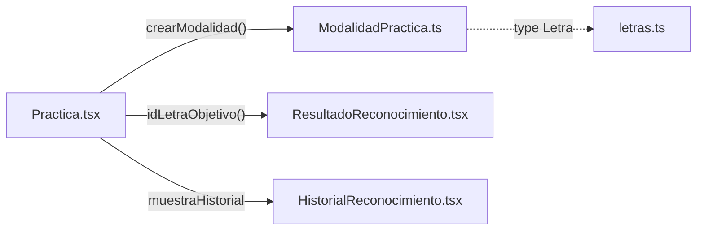
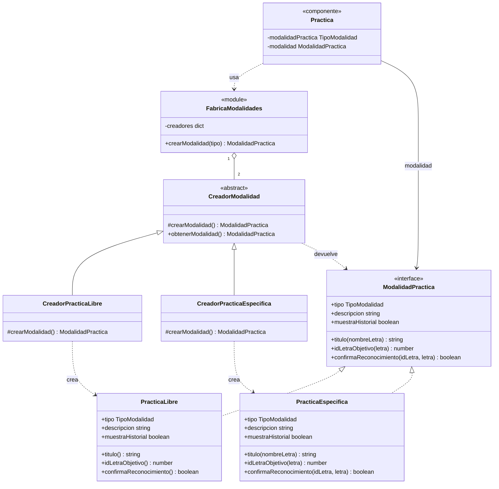

## Factory Method — Diagrama de componentes

```mermaid
flowchart LR
    PR["Practica.tsx"] -->|"crearModalidad()"| MP["ModalidadPractica.ts"]
    MP -.->|"type Letra"| LET["letras.ts"]
    PR -->|"idLetraObjetivo()"| RES["ResultadoReconocimiento.tsx"]
    PR -->|"muestraHistorial"| HIS["HistorialReconocimiento.tsx"]
```

## Factory Method — Diagrama de clases (UML)

```mermaid
classDiagram
    direction TB

    class ModalidadPractica {
        <<interface>>
        +tipo TipoModalidad
        +descripcion string
        +muestraHistorial boolean
        +titulo(nombreLetra) string
        +idLetraObjetivo(letra) number
        +confirmaReconocimiento(idLetra, letra) boolean
    }

    class PracticaLibre {
        +tipo TipoModalidad
        +descripcion string
        +muestraHistorial boolean
        +titulo() string
        +idLetraObjetivo() number
        +confirmaReconocimiento() boolean
    }

    class PracticaEspecifica {
        +tipo TipoModalidad
        +descripcion string
        +muestraHistorial boolean
        +titulo(nombreLetra) string
        +idLetraObjetivo(letra) number
        +confirmaReconocimiento(idLetra, letra) boolean
    }

    class CreadorModalidad {
        <<abstract>>
        #crearModalidad() ModalidadPractica
        +obtenerModalidad() ModalidadPractica
    }

    class CreadorPracticaLibre {
        #crearModalidad() ModalidadPractica
    }

    class CreadorPracticaEspecifica {
        #crearModalidad() ModalidadPractica
    }

    class FabricaModalidades {
        <<module>>
        -creadores dict
        +crearModalidad(tipo) ModalidadPractica
    }

    class Practica {
        <<componente>>
        -modalidadPractica TipoModalidad
        -modalidad ModalidadPractica
    }

    ModalidadPractica <|.. PracticaLibre
    ModalidadPractica <|.. PracticaEspecifica
    CreadorModalidad <|-- CreadorPracticaLibre
    CreadorModalidad <|-- CreadorPracticaEspecifica
    CreadorPracticaLibre ..> PracticaLibre : crea
    CreadorPracticaEspecifica ..> PracticaEspecifica : crea
    CreadorModalidad ..> ModalidadPractica : devuelve
    FabricaModalidades "1" o-- "2" CreadorModalidad
    Practica ..> FabricaModalidades : usa
    Practica --> ModalidadPractica : modalidad
```
