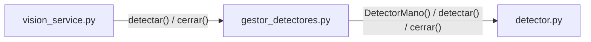
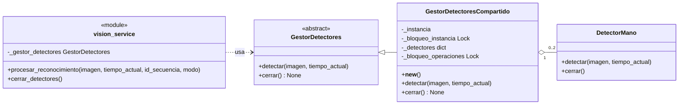
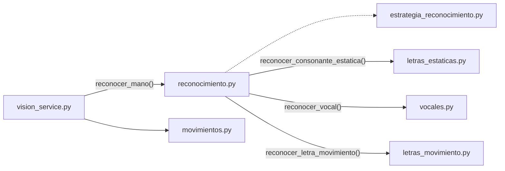
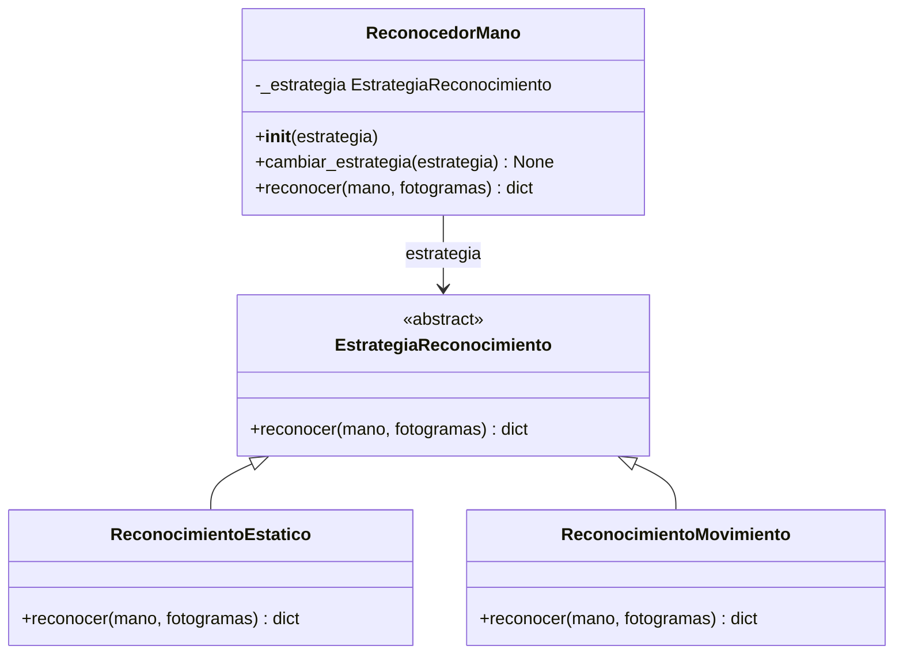

## Singleton — Diagrama de componentes

```mermaid
flowchart LR
    VS["vision_service.py"] -->|"detectar() / cerrar()"| GD["gestor_detectores.py"]
    GD -->|"DetectorMano() / detectar() / cerrar()"| DM["detector.py"]
```

## Singleton — Diagrama de clases (UML)

```mermaid
classDiagram
    direction LR

    class GestorDetectores {
        <<abstract>>
        +detectar(imagen, tiempo_actual)
        +cerrar() None
    }

    class GestorDetectoresCompartido {
        -_instancia
        -_bloqueo_instancia Lock
        -_detectores dict
        -_bloqueo_operaciones Lock
        +__new__()
        +detectar(imagen, tiempo_actual)
        +cerrar() None
    }

    class DetectorMano {
        +detectar(imagen, tiempo_actual)
        +cerrar()
    }

    class vision_service {
        <<module>>
        -_gestor_detectores GestorDetectores
        +procesar_reconocimiento(imagen, tiempo_actual, id_secuencia, modo)
        +cerrar_detectores()
    }

    GestorDetectores <|-- GestorDetectoresCompartido
    vision_service ..> GestorDetectores : usa
    GestorDetectoresCompartido "1" o-- "0..2" DetectorMano
```

## Strategy — Diagrama de componentes

```mermaid
flowchart LR
    VS["vision_service.py"] -->|"reconocer_mano()"| REC["reconocimiento.py"]
    VS --> HIST["movimientos.py"]
    REC -.-> ESTR["estrategia_reconocimiento.py"]
    REC -->|"reconocer_consonante_estatica()"| EST["letras_estaticas.py"]
    REC -->|"reconocer_vocal()"| VOC["vocales.py"]
    REC -->|"reconocer_letra_movimiento()"| MOV["letras_movimiento.py"]
```

## Strategy — Diagrama de clases (UML)

```mermaid
classDiagram
    direction TB

    class EstrategiaReconocimiento {
        <<abstract>>
        +reconocer(mano, fotogramas) dict
    }

    class ReconocimientoEstatico {
        +reconocer(mano, fotogramas) dict
    }

    class ReconocimientoMovimiento {
        +reconocer(mano, fotogramas) dict
    }

    class ReconocedorMano {
        -_estrategia EstrategiaReconocimiento
        +__init__(estrategia)
        +cambiar_estrategia(estrategia) None
        +reconocer(mano, fotogramas) dict
    }

    EstrategiaReconocimiento <|-- ReconocimientoEstatico
    EstrategiaReconocimiento <|-- ReconocimientoMovimiento
    ReconocedorMano --> EstrategiaReconocimiento : estrategia
```
