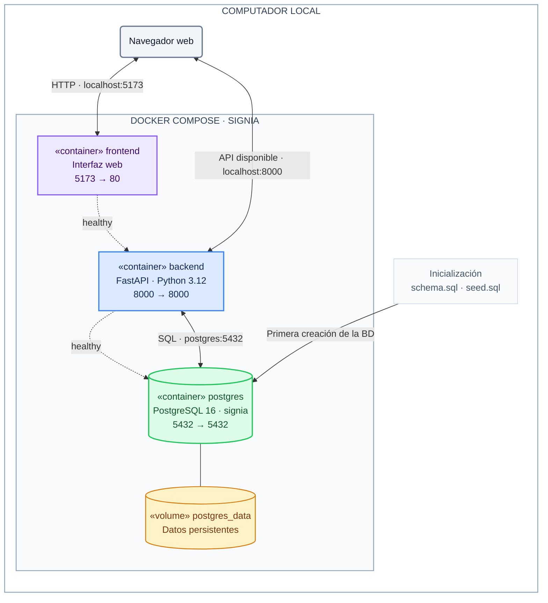

```mermaid
flowchart TB
    subgraph EQUIPO["COMPUTADOR LOCAL"]
        direction TB
        NAV("Navegador web")

        subgraph DOCKER["DOCKER COMPOSE · SIGNIA"]
            direction LR
            FRONT["«container» frontend
            Interfaz web
            5173 → 80"]
            BACK["«container» backend
            FastAPI · Python 3.12
            8000 → 8000"]
            DB[("«container» postgres
            PostgreSQL 16 · signia
            5432 → 5432")]
            VOL[("«volume» postgres_data
            Datos persistentes")]

            FRONT -.->|"healthy"| BACK
            BACK -.->|"healthy"| DB
            BACK <-->|"SQL · postgres:5432"| DB
            DB --- VOL
        end

        SQL["Inicialización
        schema.sql · seed.sql"]
        NAV <-->|"HTTP · localhost:5173"| FRONT
        NAV <-->|"API disponible · localhost:8000"| BACK
        SQL -->|"Primera creación de la BD"| DB

    end

    classDef browser fill:#F1F5F9,stroke:#64748B,stroke-width:2px,color:#0F172A
    classDef frontend fill:#EDE9FE,stroke:#8B5CF6,stroke-width:2px,color:#3B0764
    classDef backend fill:#DBEAFE,stroke:#3B82F6,stroke-width:2px,color:#172554
    classDef database fill:#DCFCE7,stroke:#22C55E,stroke-width:2px,color:#14532D
    classDef storage fill:#FEF3C7,stroke:#D97706,stroke-width:1.5px,color:#78350F
    classDef support fill:#F8FAFC,stroke:#CBD5E1,color:#475569
    class NAV browser
    class FRONT frontend
    class BACK backend
    class DB database
    class VOL storage
    class SQL support
    style EQUIPO fill:#FFFFFF,stroke:#94A3B8,stroke-width:1.5px,color:#334155
    style DOCKER fill:#F8FAFC,stroke:#94A3B8,stroke-width:1.5px,color:#334155
```
