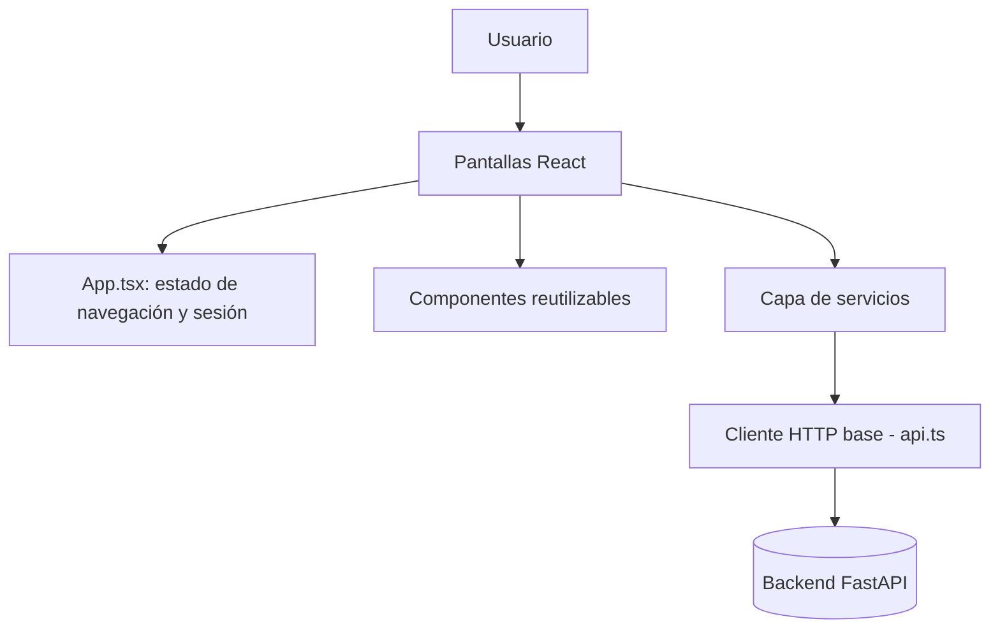

# Frontend de SignIA

Esta guía describe la implementación actual del frontend de SignIA. Su propósito es permitir que un integrante comprenda cómo está organizado el código, cómo se ejecuta localmente, cómo se comunica con el backend y qué archivos debe modificar al agregar una nueva funcionalidad.

La documentación se considera viva: debe actualizarse cada vez que cambien las pantallas, los componentes, los servicios, las variables de entorno, las dependencias o el procedimiento de ejecución.

## 1. Alcance actual

El frontend está construido con React 19 y TypeScript, usando Vite como herramienta de build. Actualmente permite:

- Registrar un nuevo usuario, con validación de formulario en el cliente antes de llamar al backend.
- Iniciar sesión con correo y contraseña, mostrando el estado de carga y los errores devueltos por el backend.
- Persistir la sesión del usuario en `sessionStorage` mientras dura la pestaña del navegador.
- Navegar entre pantallas mediante estado local en React, sin librería de enrutamiento.
- Mostrar u ocultar la barra de navegación (Navbar) según si hay sesión activa.
- Consultar el listado del alfabeto LSC letra por letra, con una vista de detalle por letra seleccionada.
- Verificar automáticamente, al cargar la aplicación, si hay comunicación con el backend.
- Cerrar sesión, eliminando el token guardado y regresando a la pantalla de login.

Los servicios para consultar el perfil del usuario (`services/perfil.ts`) ya están implementados, pero la pantalla de Perfil todavía no los consume con datos reales. El módulo de Práctica (reconocimiento por cámara) está pendiente de integrarse con el prototipo de visión por computador del backend.

## 2. Arquitectura general

El frontend usa una separación sencilla por responsabilidades:



El recorrido habitual de una acción del usuario es el siguiente:

1. El usuario interactúa con una pantalla (por ejemplo, envía el formulario de login).
2. La pantalla llama a una función de la capa de servicios (`services/`), nunca hace `fetch` directamente.
3. El servicio arma la solicitud HTTP a través de `solicitarApi` (`services/api.ts`).
4. `api.ts` agrega la URL base del backend, los encabezados, y traduce cualquier error en una excepción `ErrorApi`.
5. La pantalla recibe el resultado o captura el error y actualiza su propio estado (mensaje de error, carga, éxito).
6. Si la acción implica cambiar de pantalla, se llama a `cambiarPagina`, la función que `App.tsx` pasa como prop a cada componente.

No se utiliza React Router. La navegación completa depende del estado `pagina` centralizado en `App.tsx`.

## 3. Estructura del frontend

```text
src/front/
├── srcFront/
│   ├── App.tsx                  # Componente raíz: controla sesión y navegación
│   ├── main.tsx                 # Punto de entrada de la aplicación
│   ├── index.css                # Estilos globales (tema oscuro)
│   ├── Login.tsx                # Pantalla de inicio de sesión
│   ├── Registro.tsx             # Pantalla de registro de usuario
│   ├── Home.tsx                 # Pantalla principal tras iniciar sesión
│   ├── Aprender.tsx             # Exploración del alfabeto LSC letra por letra
│   ├── Practica.tsx             # Módulo de práctica con cámara
│   ├── Perfil.tsx               # Perfil y progreso del usuario
│   ├── components/
│   │   ├── Navbar.tsx           # Barra de navegación lateral
│   │   └── EstadoBackend.tsx    # Indicador de conexión con el backend
│   ├── services/
│   │   ├── api.ts               # Cliente HTTP base y manejo de errores
│   │   ├── autenticacion.ts     # Login, registro y manejo de sesión
│   │   ├── letras.ts            # Consulta de letras del alfabeto LSC
│   │   └── perfil.ts            # Consulta de datos de perfil y progreso
│   └── vite-env.d.ts
├── eslint.config.js
├── index.html
├── package.json
├── tsconfig.json
└── vite.config.ts
```

## 4. Componentes principales

### `App.tsx`

Es el componente raíz de la aplicación. Mantiene dos estados centrales:

- `logueado`: si hay una sesión activa o no.
- `pagina`: qué pantalla debe mostrarse (`"login"`, `"registro"`, `"home"`, `"aprender"`, `"perfil"`, `"practica"`).

Mientras `logueado` es `false`, solo se muestran Login o Registro, sin Navbar. Al iniciar sesión correctamente, `logueado` pasa a `true` y se muestra el layout completo (Navbar + la pantalla correspondiente). Cerrar sesión llama a `eliminarSesion()` del servicio de autenticación y regresa el estado a login.

`App.tsx` también renderiza siempre el componente `EstadoBackend`, sin importar la pantalla activa.

### `Login.tsx`

Formulario controlado (`correo`, `contrasena`) con estados adicionales `cargando` y `mensajeError`. Al enviarse:

1. Valida que ambos campos no estén vacíos.
2. Llama a `iniciarSesion` del servicio de autenticación.
3. Si es exitoso, guarda la sesión (`guardarSesion`) y notifica a `App.tsx` mediante la prop `alIniciarSesion`.
4. Si falla, muestra el mensaje de error (`ErrorApi.message` o uno genérico).

### `Registro.tsx`

Formulario controlado con validación completa en el cliente antes de llamar al backend, replicando las mismas reglas que aplica el backend (nombre 2-100 caracteres, correo válido de 5-150 caracteres, contraseña de 12-200 caracteres con confirmación). Los errores se muestran debajo de cada campo (`aria-invalid`, `aria-describedby`) y se limpian a medida que el usuario corrige. Si el backend responde `422`, se informa que los datos fueron rechazados; en caso de éxito, se reemplaza el formulario por un mensaje de confirmación con acceso directo a Login.

### `Home.tsx`

Pantalla de bienvenida tras iniciar sesión, con acceso directo a Práctica y Perfil mediante tarjetas (`cambiarPagina`).

### `Aprender.tsx`

Lista las letras del alfabeto LSC como botones seleccionables. Al elegir una letra, muestra su descripción y un espacio para la imagen de la seña (`ruta_imagen`, actualmente sin datos reales cargados desde el backend — usa un arreglo local de ejemplo). Incluye acceso directo a Práctica para la letra seleccionada.

> Pendiente: conectar este componente al servicio `obtenerLetras()` (`services/letras.ts`) en lugar del arreglo local `letras` que contiene actualmente.

### Componentes reutilizables (`components/`)

- **`Navbar.tsx`**: barra lateral visible solo con sesión activa. Resalta la opción activa según `paginaActual` y expone `cerrarSesion`.
- **`EstadoBackend.tsx`**: al montarse, llama a `comprobarConexionBackend()` (`GET /health`) y muestra un mensaje de estado (`comprobando`, `conectado`, `error`), visible en toda la aplicación.

## 5. Capa de servicios

Toda la comunicación HTTP pasa por `services/`, nunca se hace `fetch` directamente desde una pantalla.

### `services/api.ts`

Define `solicitarApi<T>`, la función base que:

- Arma la URL completa a partir de `VITE_API_URL` (por defecto `http://127.0.0.1:8000`).
- Agrega `Content-Type: application/json` automáticamente cuando hay `body`.
- Si la respuesta no es exitosa (`!respuesta.ok`), lanza `ErrorApi` con el mensaje `detail` que envía el backend, o uno genérico si no hay conexión.
- Devuelve `undefined` en respuestas `204`, y el JSON parseado en el resto de los casos.

También expone `comprobarConexionBackend()`, usado por `EstadoBackend`.

### `services/autenticacion.ts`

- `iniciarSesion(credenciales)` → `POST /auth/login`.
- `registrarUsuario(datos)` → `POST /auth/registro`.
- `guardarSesion`, `obtenerSesion`, `eliminarSesion` → manejan la sesión en `sessionStorage` bajo la clave `signia_sesion`.

### `services/letras.ts`

- `obtenerLetras()` → `GET /letras`. Aún no está siendo consumido por `Aprender.tsx` (ver pendientes).

### `services/perfil.ts`

- `consultarPerfil(token)` → `GET /perfil` con encabezado `Authorization`. Implementado pero aún no consumido por `Perfil.tsx`.

## 6. Comunicación con el backend

| Servicio frontend | Endpoint backend | Notas |
|---|---|---|
| `comprobarConexionBackend` | `GET /health` | Sin autenticación |
| `iniciarSesion` | `POST /auth/login` | Devuelve `access_token` y datos del usuario |
| `registrarUsuario` | `POST /auth/registro` | Rol siempre `usuario`, asignado por el backend |
| `obtenerLetras` | `GET /letras` | Sin autenticación; aún no integrado en `Aprender.tsx` |
| `consultarPerfil` | `GET /perfil` | Requiere token; aún no integrado en `Perfil.tsx` |

El backend habilita CORS para `http://localhost:5173` y `http://127.0.0.1:5173` (puerto por defecto de Vite), además de los puertos `3000`. El frontend debe seguir corriendo en uno de esos orígenes durante el desarrollo local para evitar errores de CORS.

## 7. Variables de entorno

El frontend usa una única variable, leída por Vite:

```env
VITE_API_URL=http://127.0.0.1:8000
```

Si no se define, `services/api.ts` usa ese mismo valor por defecto — por lo que no es obligatoria en desarrollo local mientras el backend corra en el puerto estándar.

## 8. Instalación y ejecución local

### Requisitos

- Node.js (versión reciente, compatible con Vite 8 y React 19).
- El backend de SignIA corriendo localmente en `http://127.0.0.1:8000` (ver documentación del backend).

### Pasos

```bash
cd src/front
npm install
npm run dev
```

La aplicación queda disponible en `http://localhost:5173` (puerto por defecto de Vite).

Otros scripts disponibles (`package.json`):

```bash
npm run build     # Compila TypeScript y genera el build de producción
npm run lint       # Ejecuta ESLint sobre el proyecto
npm run preview    # Sirve localmente el build de producción
```

## 9. Flujo de navegación

```text
Sin sesión activa:
   Login  ⇄  Registro
     │
     └── (login exitoso) ──▶ Home

Con sesión activa (Navbar visible):
   Home ─┬─▶ Aprender ──▶ Practica
         ├─▶ Practica
         ├─▶ Perfil
         └─▶ (cerrar sesión) ──▶ Login
```

## 10. Cómo agregar una funcionalidad

Para mantener la separación actual, una nueva pantalla o funcionalidad normalmente requiere:

1. Si consume datos del backend, agregar la función correspondiente en `services/` (nunca hacer `fetch` directo desde el componente).
2. Crear el componente de la pantalla en `srcFront/`, recibiendo `cambiarPagina` como prop si necesita navegar.
3. Registrar la nueva pantalla en el estado condicional de `App.tsx`.
4. Si la pantalla debe ser accesible desde la barra lateral, agregar el botón correspondiente en `Navbar.tsx`.
5. Reutilizar las clases CSS ya definidas en `index.css` (`.pantalla`, `.logo`, `.enlace`, `.tarjetas`, etc.) para mantener consistencia visual con el tema oscuro existente.
6. Actualizar esta guía y el diagrama de navegación si la nueva pantalla cambia el flujo.

## 11. Estilos (`index.css`)

El proyecto usa un único archivo de estilos globales (`index.css`), sin CSS Modules ni librerías de estilos (como Tailwind o Styled Components). Todas las pantallas y componentes comparten esta hoja de estilos.

### Tema visual

El proyecto sigue un tema oscuro consistente en toda la aplicación:

| Color | Uso |
|---|---|
| `#111` | Fondo principal de la aplicación |
| `#1e1e1e` / `#181818` | Fondo de tarjetas, paneles y la barra lateral (Navbar) |
| `#222` | Fondo de elementos internos (inputs, módulos, botones del alfabeto) |
| `#2563eb` | Azul principal — botones primarios, bordes activos, acentos |
| `#60a5fa` | Celeste — texto de énfasis, íconos activos, hover |
| `#facc15` | Amarillo — botones de llamado a la acción destacados (ej. "Continuar") |
| `#aaa` | Gris — texto secundario y descripciones |
| `#333` | Bordes sutiles entre elementos |

### Organización por bloques

El archivo no usa una metodología formal (como BEM), sino que agrupa las clases por la pantalla o componente al que pertenecen, en este orden:

1. **Reset y base** (`*`, `body`, `button`): normaliza márgenes y define la tipografía y colores globales.
2. **Layout general** (`.app`, `main`, `nav`): estructura de dos columnas, Navbar fija a la izquierda y contenido principal a la derecha.
3. **Navbar** (`.logoNav`, `.Opciones`, `.botonMenu`, `.botonActivo`): estilos de la barra lateral, incluyendo animaciones de hover (`transform: translateX`) y el estado resaltado de la opción activa.
4. **Perfil** (`.perfil`, `.perfilHeader`, `.avatar`, `.estadisticas`, `.progreso`, `.modulos`, `.historial`, `.continuar`): tarjetas con estadísticas y barras de progreso.
5. **Práctica** (`.practica`, `.zonaPracti`, `.camara`, `.deteccion`, `.panelPractica`, `.objetivo`, `.instrucciones`, `.alfabeto`): layout de dos columnas, cámara a la izquierda y panel de instrucciones a la derecha.
6. **Login / Registro / Home** (`.pantalla`, `.logo`, `.enlace`, `.tarjetas`, `.tarjeta`): pantallas centradas verticalmente, reutilizando la misma clase base `.pantalla` para las tres, de modo que compartan el mismo layout y solo cambie el contenido interno.

### Por qué se reutiliza `.pantalla` en Login, Registro y Home

En lugar de crear una clase distinta por cada pantalla, se definió una única clase `.pantalla` (contenedor centrado, con el fondo y color de texto del tema) que las tres reutilizan. Esto evita duplicar CSS y garantiza que si se ajusta el estilo base (por ejemplo, el padding), cambie de forma consistente en las tres pantallas a la vez.

### Puntos pendientes de corrección

- Hay un error de tipeo en `.alfabeto button`: `border: 1px salid #444;` debería ser `solid`.
- El selector `.alfabeto letraActiva` (sin punto) no aplica como clase — debería ser `.alfabeto .letraActiva`.

## 12. Componentes pendientes o reservados

- Conectar `Aprender.tsx` al servicio real `obtenerLetras()` en lugar del arreglo de letras de ejemplo.
- Cargar las imágenes reales de cada seña (`ruta_imagen`) — actualmente el campo llega vacío.
- Conectar `Perfil.tsx` al servicio `consultarPerfil()` con los datos reales de progreso.
- Integrar `Practica.tsx` con el módulo de visión por computador del backend (`app/vision`), aún prototipo independiente.
- Manejo de expiración/renovación de sesión cuando el token JWT vence.
- Pruebas automatizadas de los formularios de Login y Registro.

Esta sección debe reducirse o actualizarse cuando esos componentes sean implementados.

## 13. Lista de mantenimiento

En cada PR que modifique el frontend se debe comprobar si también cambió alguno de estos elementos:

- [ ] Estructura de carpetas.
- [ ] Pantallas y flujo de navegación.
- [ ] Componentes reutilizables.
- [ ] Servicios o endpoints consumidos.
- [ ] Variables de entorno.
- [ ] Dependencias y versiones (`package.json`).
- [ ] Instrucciones de instalación o ejecución.
- [ ] Funcionalidades pendientes.